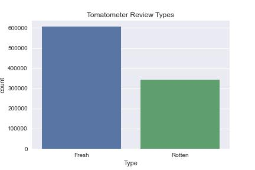
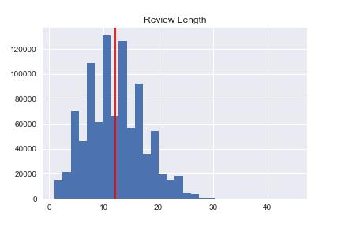
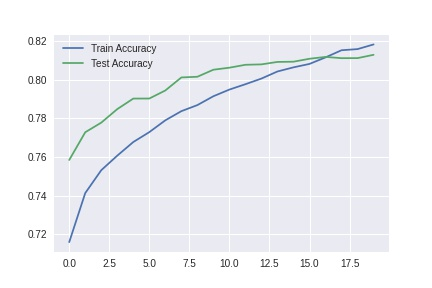
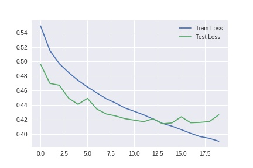
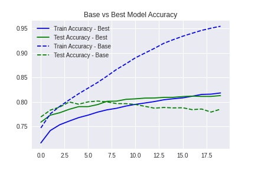
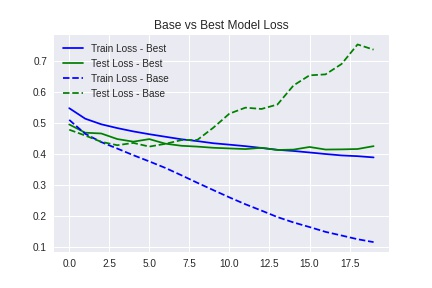

# Sentiment Classifier for Movie Reviews

## Sentiment Analysis and Binary Classification of Movie Reviews through Natural Language Processing

---
### Motivation
---

According to this [study](https://www.studyfinds.org/survey-the-average-adult-will-watch-more-than-78000-hours-of-tv/), "the average person will spend more than 78,000 hours in front of the television over their lifetime" and to break it down further: an average of 3,639 movies and 31,507 episodes of television.

Most people in modern times may be unable to count the movies, films, and TV shows (we shall use the former term generally for this project) they have watched. Might as well watch those of good quality and the ones of your preference, right?

My fascination for movies over the years has made me very selective in picking what movies to watch. I tend to stick to my favorite genres most of the time and I have had developed a taste to determining what makes a good movie: from the storyline, characters and conversations to the cinematography and music score used. Occasionally, I would watch others just out of curiosity that I may find not to my liking.

Although judging a movie whether good or bad is subjective, when I thinking of what movie to watch next I would try to find out what majority of people think about them and visit websites such as Rotten Tomatoes and IMDb.

Being a self-proclaimed movie aficionado and my new interest to pursue the field of natural language processing (NLP) and has made me decide to focus on a sentiment analysis of movie reviews.

---

### Business Use Case

This project involves training a model on around 210,000 movie reviews with a goal of accurately classifying review types (whether positive or negative) and get a feel of the sentiment of these reviews. This model is then tested on unseen data with an aim to develop a simple Flask app that takes in a movie review text string and outputs the review label/category.

One of the benefits to applying classification of text through sentiment analysis is the automation of evaluating documents in different industries: from movie reviews to customer reviews.

---

### The Rotten Tomatoes Movie Review Dataset
---
Out of all the websites that one can find movie reviews, [Rotten Tomatoes](https://www.rottentomatoes.com/) (RT) has been my consistent go-to place on the web as it provides easy access to a variety of reviews by Tomatometer-approved critics from all over the world which have been aggregated from different platforms. 

RT has a rating system that makes use of the "Tomatometer" which indicates a percentage of positive reviews for a movie. A threshold of at least 60% score determines that a review is of a "Fresh" status (indicated by a red tomato) while those less than 60% indicates "Rotten" status (shown with a green splat).

There is a catch though: it 's not just all about the critics. The Tomatometer takes into consideration only the reviews by critics but there is also a separate "Audience Score" system for the everyday casual viewers and this score is determined by star ratings (at least 3.5 rating for positive) the audience provides.

Most often than not, the Tomatometer and the Audience Score would tend to coincide but there have been few rare cases 

A dataset of Rotten Tomatoes of over 1.1M reviews of more at least 17,000 movies up to October 2020 can be obtained from [Kaggle](https://www.kaggle.com/stefanoleone992/rotten-tomatoes-movies-and-critic-reviews-dataset).

For this project, I focus only on the critic reviews dataset and the on two columns, the reviews (features) and the classification (labels) and a subset of the data for training and testing was randomly selected. I also took a random sample of 300,000 reviews from the full dataset for speed purposes training and testing a model for sentiment classification.

---
### Data Cleaning and Preprocessing
---
The following preprocessing steps for NLP were applied to each of the reviews on the dataset:

1) Tokenization
2) Apply Lower Case
3) Removing URLs and HTML code
4) Contraction Mapping (e.g. changing "isn't" to "is not")
5) Removing Punctuations
6) Removing Stop Words
7) Lemmatization

The data cleaning and preprocessing notebook can be found [here](src/01-preprocessing.ipynb)

---
### Exploratory Data Analysis
---
After around 6% of rows containing missing values were removed, we can find that the cleaned data contains roughly 64% Fresh reviews and 36% Rotten reviews.

It's also helpful to note that the cleaned review lengths don't go beyond 30. This can be used during 

The EDA notebook can be found [here](src/02-eda.ipynb)

---
### GloVe Embeddings
---

[GloVe](https://nlp.stanford.edu/projects/glove/) (Global Vectors for Word Representation) is an unsupervised learning algorithm that generates word vector representations that highlight linear substructures of the word vector space which allow words with similar meanings to have a similar representation. Training is based on aggregated global word to word co-occurrence statistics from a corpus. 

Movie reviews are trained and passed into GloVe embeddings so they are represented as numbers. The embeddings were trained on a dataset with a corpus of 3.6M+ words with a vocabulary of 400 thousand words. There are few different embedding vector sizes such as 50, 100, 200 and 300 dimensions. The 300D variant of GloVe pretrained corpus model was used to represent the words for this project to add 

---
### Modeling
---
While there have been many studies and projects involving classical machine learning and deep learning algorithms to do text classification already, I wanted to focus only on harnessing recurrent neural networks, more specifically the long short-term memory (LSTM) for this project.

LSTMs are effective in sequence predicting problems as they can memorize past information and handles long sequences well.

The baseline model is a LSTM with 300 units and a dropout of 0.1.The Adam optimizer is set to have a learing rate of 3e-4. The matrix that was built with GloVe embeddings would be fed into it.

After performing hyperparameter tuning through randomized search cross validation, I fit the model through 20 epochs and a batch size of 64.

The notebook can be found [here](src/03-modeling.ipynb)

---

### Evaluation
---

After multiple iterations in training, I picked the best model with the following accuracy loss.

To prevent overfitting on the training data, a dropout of 0.6 was added to fitting.

